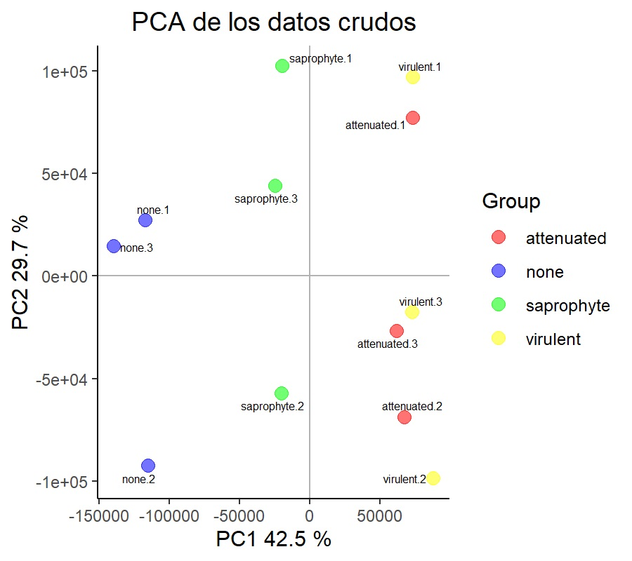
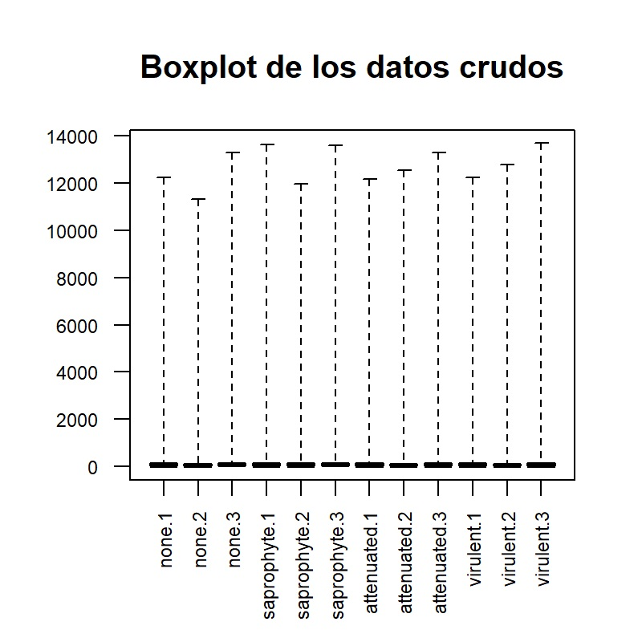
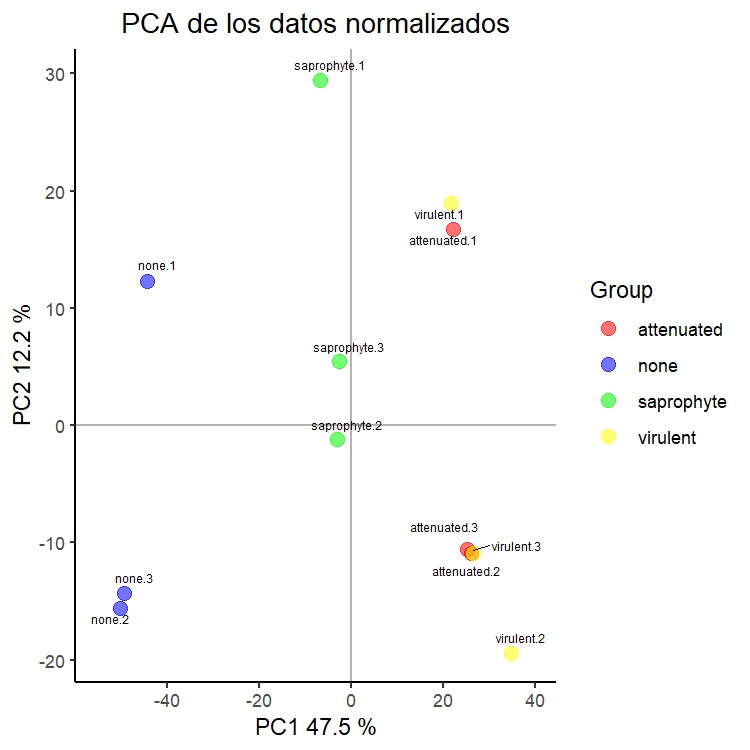
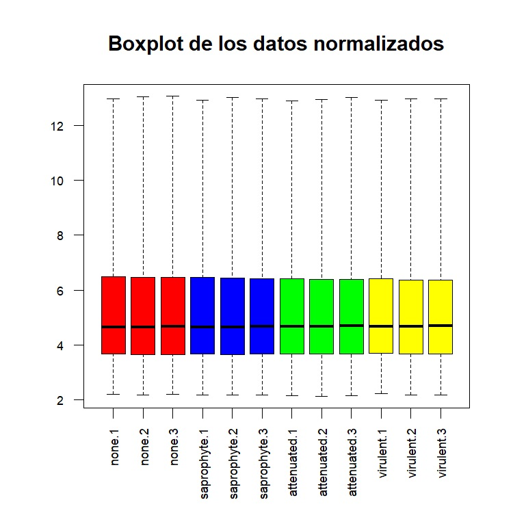
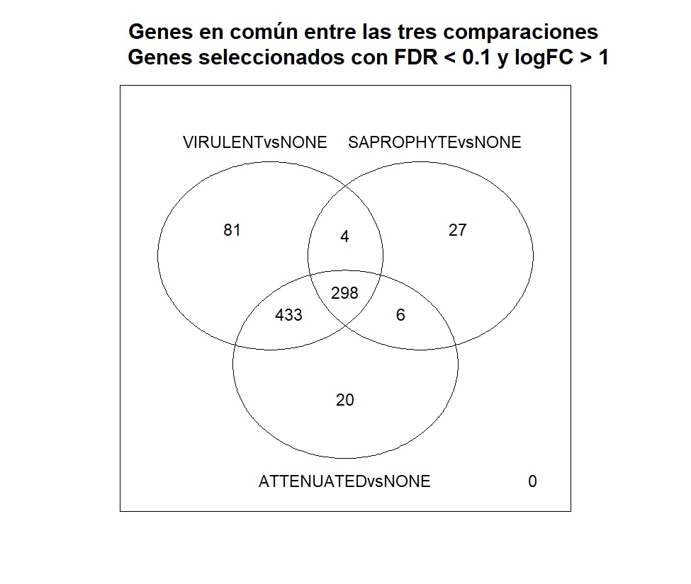
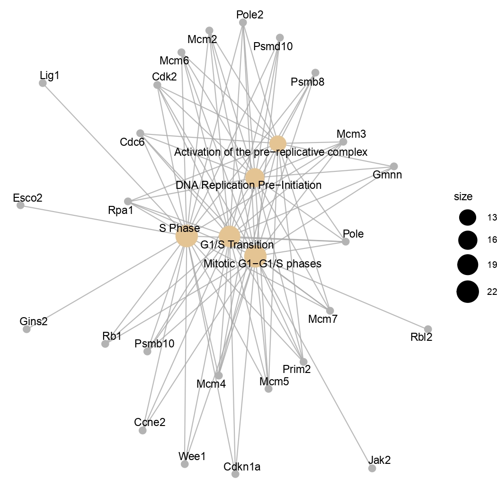
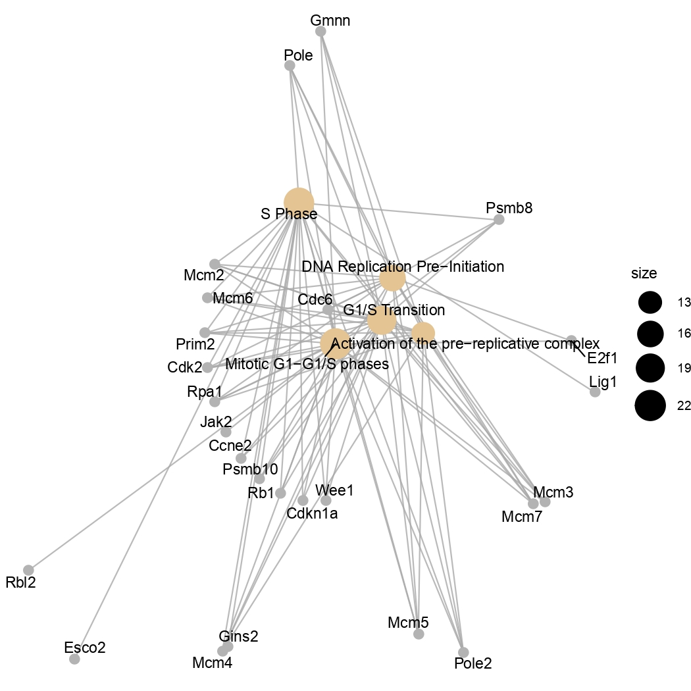
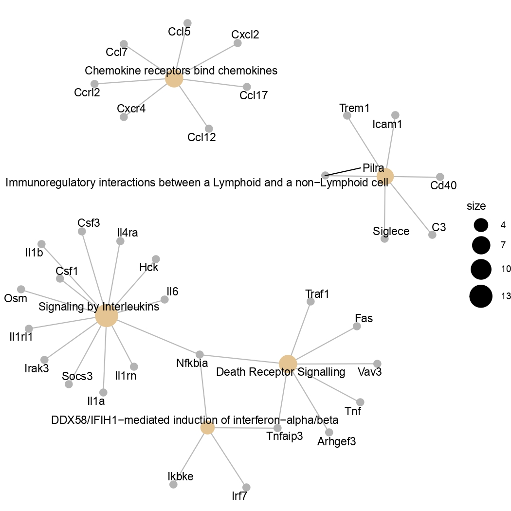

```{r setup, include=FALSE}
knitr::opts_chunk$set(echo = TRUE)
```

### Contenidos

#### Objetivo
#### Materiales y métodos
* Información sobre el estudio a reanalizar
* Preparación de los datos
* Control de calidad de los datos crudos
* Normalización de los datos
* Control de calidad de los datos normalizados
* Filtrado de genes
* Identificación de genes diferencialmente expresados
* Anotación de los resultados
* Comparación entre distintas comparaciones
* Análisis de significación biológica
* Disponibilidad de los datos y reproducibilidad

#### Resultados
* Contenido del archivo targets
* Control de calidad de los datos crudos
  * Resumen
  * Análisis de componentes principales
  * Boxplot
* Control de calidad de los datos normalizados
  * Resumen
  * Análisis de componentes principales
  * Boxplot
* Filtrado de genes
* Identificación de genes diferencialmente expresados
  * Matriz de diseño
  * Matriz de contrastes
  * Tablas topTable
* Anotación de los resultados
* Comparación entre distintas comparaciones. Diagrama de Venn.
* Análisis de significación biológica
  * Número de genes seleccionados
  * Comparación ATTENUATED vs NONE
    * Tabla
    * Gráfico de red
  * Comparación VIRULENT vs NONE
    * Tabla
    * Gráfico de red
  * Comparación SAPROPHYTE vs NONE
    * Tabla
    * Gráfico de red


### Objetivo

Se pretende realizar un reanálisis de microarrays utilizando los archivos CEL de un estudio en el que se analizó el transcriptoma de macrófagos murinos infectados con diferentes cepas de la bacteria *Leptospira*, que presentan diferentes niveles de virulencia. Se utilizaron muestras de la cepa virulenta *Leptospira interrogans* serovar Copenhageni (FIOCRUZ L1-130), la cepa atenuada *L. interrogans* serovar Copenhageni M20, y la cepa saprófita *L.biflexa* serovar Patoc (FIOCRUZ -Patoc I).
  

El estudio fue publicado en 2018 y los artículos asociados se pueden encontrar en la siguientes páginas web: <https://www.ncbi.nlm.nih.gov/pmc/articles/PMC5758930/>
<https://www.ncbi.nlm.nih.gov/pmc/articles/PMC6892507/>.

### Materiales y métodos

* Información sobre el estudio a reanalizar. En el estudio se investigó el efecto producido por la infección de macrófagos murinos con 3 cepas de la bacteria *Leptospira*. Se utilizaron células no infectadas (*none*) y células infectadas con una cepa saprófita (*saprophyte*), una cepa atenuada (*attenuated*) o una cepa virulenta (*virulent*). El RNA se extrajo de los macrófagos 6 horas después de la infección. Estamos ante un diseño experimental de un factor con cuatro niveles. El estudio comprende un total de 12 muestras, pues se hicieron 3 réplicas por cada grupo. Se utilizaron microarrays Mouse Gene 2.1 ST Array Strip (Affymetrix®), que cubren más de 28000 tránscritos codificantes y 7000 RNA no codificantes largos. Los archivos .CEL se encuentran en la base de datos Gene Expression Omnibus (GEO) con el siguiente *accession number*: [GSE105141](https://www.ncbi.nlm.nih.gov/geo/query/acc.cgi?acc=GSE105141).

* Preparación de los datos. Se creó un archivo .csv, al que se llamó *targets*, que relaciona cada archivo .CEL con la información experimental de su muestra correspondiente (en nuestro caso, el tipo de bacteria con el que se infectaron los macrófagos). Se leyeron los archivos .CEL y se almacenaron en una variable que llamamos *rawdata*, un *ExpressionSet* que contiene también la información del archivo *targets*.

* Control de calidad de los datos crudos. Se usó el paquete ArrayQualityMetrics, que genera un resumen, y se complementó con un análisis de componentes principales y un boxplot. Como input se utilizaron los valores de expresión contenidos en el *ExpressionSet* *rawdata*, creado en el paso anterior.

* Normalización de los datos. Se aplicó el método Robust Multichip Analysis al *ExpressionSet* *rawdata*, creando un nuevo *ExpressionSet* al que se llamó *eset_rma*.

* Control de calidad de los datos normalizados. Se repitió el mismo tipo de control de calidad que para los datos crudos, pero esta vez partiendo del *ExpressionSet* *eset_rma*.

* Filtrado de genes. Con el objetivo de reducir el número de test a realizar, se eliminaron aquellos genes con menor variación, pues se espera que estos genes no esten diferencialmente expresados. Para ello se usó la función *nsFilter* del paquete *genefilter*. Además, se eliminaron las *probesets* no asociadas a un gen, usando el packete de anotación mogene21sttranscriptcluster.db. Como input, se utilizó el *ExpressionSet* *eset_rma*, que contiene los datos normalizados. Con la función *nsFilter* se obtuvo un informe con el número de *probesets* filtrados. El conjunto de valores de expresión normalizados y filtrados se almacenó en un nuevo *Expressionset* que se llamó *eset_filtered*.

* Identificación de genes diferencialmente expresados. Se utilizí el método de modelos lineares para microarrays que viene implementado en el paquete *limma*. Primero se creó una matriz de diseño, que asigna cada muestra a un grupo experimental. A continuación, se creó la matriz de contrastes, que describe las comparaciones entre los grupos. En este caso, se comparó el grupo de muestras no infectadas con cada grupo de muestras infectadas con una cepa bacteriana en concreto, por lo que la matriz de contrastes creada contiene 3 comparaciones (ATTENUATEDvsNONE, VIRULENTvsNONE y SAPROPHYTEvsNONE). Con los valores de expresión normalizados y filtrados y las matrices de diseño y contrastes, se estimó el modelo y los contrastes y se realizaron las pruebas de significancia. Los p-valores se ajustaron para controlar la tasa de falsos positivos. Todos estos pasos se realizaron utilizando distintas funciones del paquete *limma*. Como output, usando la función topTable, se obtuvo por cada contraste una lista de genes ordenados de menor a mayor p-valor.

* Anotación de los resultados. Las listas generadas con topTable dan información sobre los *probesets*. Mediante el proceso de anotación, se asociaron los *probesets* con sus correspondientes genes. Para cada *probeset* se buscó la información del símbolo y el nombre del gen y el identificador Entrez. Como input se usaron las tablas generadas con topTable en el paso anterior y el paquete mogene21sttranscriptcluster.db, que permite anotar datos procedentes de microarrays de Affymetrix usando repositorios públicos. Como resultado, se obtuvieron nuevas tablas con columnas adicionales conteniendo la información de los genes.

* Comparación entre distintas comparaciones. Mediante un diagrama de Venn se pueden observar cuántos genes están diferencialmente expresados en cada comparación y cuántos en más de una comparación. Para producir este diagrama se utilizaron las funciones *decideTests* y *VennDiagram* del paquete limma. Como genes diferencialmente expresados se seleccionaron aquellos con FDR < 0.1 y log fold change >1.

* Análisis de significación biológica. A partir de una lista de genes diferencialmente expresados entre dos condiciones (comparación), el análisis de enriquecimiento busca las funciones, los procesos biológicos y las vías moleculares que están sobrerrepresentadas o infrarrepresentadas. Para hacer este análisis primero se crearon las listas de genes, seleccionando en cada comparación los genes que presentan un FDR <0.0000005, usando las tablas creadas con topTable. A continuación se realizó el análisis mediante el paquete ReactomePA. Como input se utilizaron estas listas de genes y como universo de genes, aquellos con al menos una anotación en Gene Ontology. Como output se obtuvieron, por cada comparación: una tabla con los "pathways" enriquecidos y la información estadística asociada y un gráfico de red que relaciona los "pathways" y los genes.

* Disponibilidad de los datos y reproducibilidad. Los datos utilizados así como un script para reproducir este análisis se encuentran en el siguiente repositorio de github: <https://github.com/teguesterillo/ADO-PEC1.git>


### Resultados

#### * Contenido del archivo *targets*:

```{r echo=FALSE, results='asis'}
library(knitr)
targets <- read.csv2("C:/Working directory PEC1/data/targets.csv", header = TRUE, sep = ";")
kable(targets, booktabs = TRUE, align=rep('l', 5))
```

#### * Control de calidad de los datos crudos

#####  * Resumen


Comos sólo se observó una marca en una de las muestras en el resumen del paquete ArrayQualityMetrics, se decidió utilizar todos los arrays en el análisis.

#####  * Análisis de componentes principales:



El primer componente captura el 42,5% del total de la variabilidad de las muestras. Se puede decir que el tipo de bacteria es lo que contribuye principalmente a esta variabilidad. Las muestras no infectadas están a la izquierda, las infectadas con la cepa saprofítica están en el centro, y las infectadas con la cepa virulenta y la cepa atenuada están a la derecha. Las muestras de estas dos últimas cepas, que pertenecen a la misma especie (*Leptospira interrogans*), quedan entremezcladas.

#####  * Boxplot



#### * Control de calidad de los datos normalizados

#####  * Resumen


Se puede observar la ausencia de outliers tras la normalización de los datos.

#####  * Análisis de componentes principales



Ahora el primer componente explica el 47.5% de la variabilidad. Las muestras se siguen agrupando según la cepa: muestras no infectadas a la izquierda, muestras infectadas con la cepa saprofítica en el centro y muestras infectadas con la cepa virulenta o la atenuada a la derecha.

#####  * Boxplot:



#### * Filtrado de genes.

Esta es la lista que se crea al aplicar *nsFilter*:

```{r echo=FALSE, results='asis'}
filterlog <- list("numDupsRemoved" = 671, "numLowVar" = 17973, "numRemoved.ENTREZID" = 16710)
print(filterlog)
```

Tras el filtrado, quedaron 5991 genes.

#### * Identificación de genes diferencialmente expresados.

#####  * Matriz de diseño

```{r echo=FALSE, results='asis'}
library(knitr)
designmat <- read.csv2("C:/Working directory PEC1/figures/designmat.csv", header = TRUE, sep = ",")
kable(designmat, booktabs = TRUE, align=rep('l', 5))
```


#####  * Matriz de contrastes

```{r echo=FALSE, results='asis'}
library(knitr)
contrasts <- read.csv2("C:/Working directory PEC1/figures/contrasts.csv", header = TRUE, sep = ",")
kable(contrasts, booktabs = TRUE, align=rep('l', 5))
```


#####  * Tablas topTable

A continuación se muestran las primeras líneas de una de las tres tablas generadas con topTable (la correspondiente a la comparación ANNOTATEDvsNONE):


```{r echo=FALSE, results='asis'}
library(knitr)
toptable <- read.csv2("C:/Working directory PEC1/figures/topTable.csv", header = TRUE, sep = ",")
kable(toptable, booktabs = TRUE, align=rep('l', 5))
```


#### * Anotación de los resultados

A continuación se muestran las primeras filas de una de las tablas creadas tras la anotación (la correspondiente a la comparación ANNOTATEDvsNONE). Solo se muestran las primeras cuatro columnas (las que contienen los identificadores de los *probesets* y la información sobre los genes):


```{r echo=FALSE, results='asis'}
library(knitr)
topannotated <- read.csv2("C:/Working directory PEC1/figures/topannotated.csv", header = TRUE, sep = ",")
kable(topannotated, booktabs = TRUE, align=rep('l', 5))
```


#### * Comparación entre distintas comparaciones. Diagrama de Venn.



El diagrama de Venn muestra que la mayoría de genes diferencialmente expresados son compartidos entre las comparaciones cepa virulenta vs no infección y cepa atenuada vs no infección (433 genes) o en las 3 comparaciones (298 genes).

#### * Análisis de significación biológica.

#####  * Número de genes seleccionados

             VIRULENTvsNONE   SAPROPHYTEvsNONE  ATTENUATEDvsNONE 

             517              138               470 
             
A continuación se muestran los resultados generados por el paquete ReactomePA 

#####  * Comparación ATTENUATED vs NONE:

  * Tabla

Se muestran las primeras líneas y columnas.

```{r echo=FALSE, results='asis'}
library(knitr)
ReactomeATTENUATED <- read.csv2("C:/Working directory PEC1/figures/ReactomeATTENUATED.csv", header = TRUE, sep = ",")
kable(ReactomeATTENUATED, booktabs = TRUE, align=rep('l', 5))
```


  * Gráfico de red



#####  * Comparación VIRULENT vs NONE:

 * Tabla

Se muestran las primeras líneas y columnas.

```{r echo=FALSE, results='asis'}
library(knitr)
ReactomeVIRULENT <- read.csv2("C:/Working directory PEC1/figures/ReactomeVIRULENT.csv", header = TRUE, sep = ",")
kable(ReactomeVIRULENT, booktabs = TRUE, align=rep('l', 5))
```

  * Gráfico de red



#####  * Comparación SAPROPHYTE vs NONE:

 * Tabla

Se muestran las primeras líneas y columnas.

```{r echo=FALSE, results='asis'}
library(knitr)
ReactomeSAPROPHYTE <- read.csv2("C:/Working directory PEC1/figures/ReactomeSAPROPHYTE.csv", header = TRUE, sep = ",")
kable(ReactomeSAPROPHYTE, booktabs = TRUE, align=rep('l', 5))
```


  * Gráfico de red:

